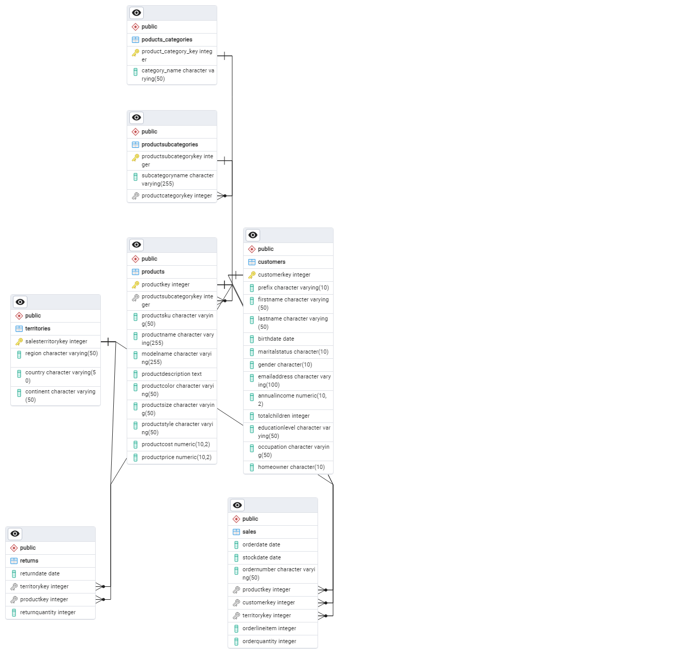

# Resoluções 
Inicialmente foi utilizado Python e PostgreSQL para carregar os dados e gerar o banco de dados.\
* __Python__
1. Desenvolvi um código para carregar os arquivos .csv e verificar algumas inconsistências nos dados. 
2. Alguns arquivos .csv tinham problemas de formatação nas datas e valores númericos com a presença de strings. Portanto, escrevi um script com o pandas para ler esses arquivos, formatá-los e salvá-los em outra pasta. 
3. Criei dois scripts, um para os dados relacionados aos produtos e os outros para os demais. As tabelas de produtos, categorias dos produtos e subcategorias, foram feitas separadamente, para verificar se as relações eram mantidas durante o processo de formatação. 
* __PostgreSQL__
1. Utilizei o software para carregar o banco de dados. Primeiramente, criei as tabelas e as referências entre cada tabela. Gerando o seguinte  diagrama de entidade  relacionamento:

2. Importei as tabelas corrigidas, para o Postgres.
3. Com isso, foi possível desenvolver cada script para responder as perguntas dos problemas